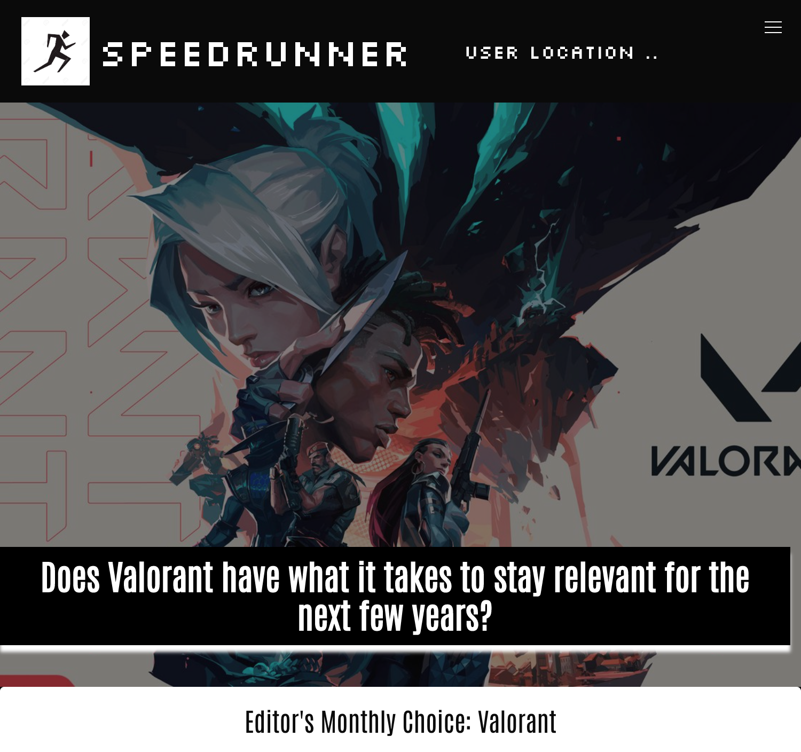

# Speed-Runner
Project 1: University of Arizona Coding Bootcamp

### **Contributors**
[James Patmore](https://github.com/jamestpatmore)
[Ronald Martinez](https://github.com/RonaldMartinez00)
[Jennifer Mayo](https://github.com/jlmayo)

## **Table of Contents**
* [The Repository](#the-repository)
* [The Scenario](#the-scenario)
* [The Project](#the-project)
* [User Story](#user-story)
* [Technologies Used](#technologies-used)
* [Result](#result)

### **The Repository**
This repository (Speed-Runner) contains HTML code, CSS stylesheets, and script.js files for Javascript code. Each contributor has a branch that has been merged with main. Some use has been made of GitHub Project workflow. This is a submission for University of Arizona Coding Boot Camp's Project 1 assignment.

### **The Scenario**
As a team, we were tasked with conceiving of and executing a design for a a real-world front-end application. This application should solve a real-world problem by integrating data received from multiple server-side API requests. Other goals of this project were the utilization of agile development methodologies in order to work collaboratively and implementing feature and bug fixes using Git branch workflow and pull requests. 

To plan the project, the team was required to compose a user story and acceptance criteria in GitHub Issues and use GitHub Project to track the status of project and tasks assigned. The goal was for the team to understand the benefits of Kanban boards.

### **The Project**
Speed-Runner is an application that provides information on recent video game releases, including trailers, rankings, and a sign up to receive timely information from the app. It also tracks user location to (in the future) provide accurate local shopping options.

### **User Story**
* AS A gamer
* I WANT to find information about video games
* SO THAT I can find the next game I want to play.

### **Technologies Used**
* Bulma.io 
* RAWG API
* Geolocation API
* HTML,CSS,JS

### **Result**

You can find the SpeedRunner app at [Speed-Runner](https://jlmayo.github.io/Speed-Runner/)

## **Completed Project**
Homepage screenshot on Mobile (yes its responsive) :iphone:

Homepage screenshot on Desktop :desktop_computer:

We have a Sign Up form where you can get some information on New Game Releases :pinched_fingers:

We have the latest and greatest trailers chosen by Us the Editors :right_anger_bubble:

We also have a Rankings Page! 

